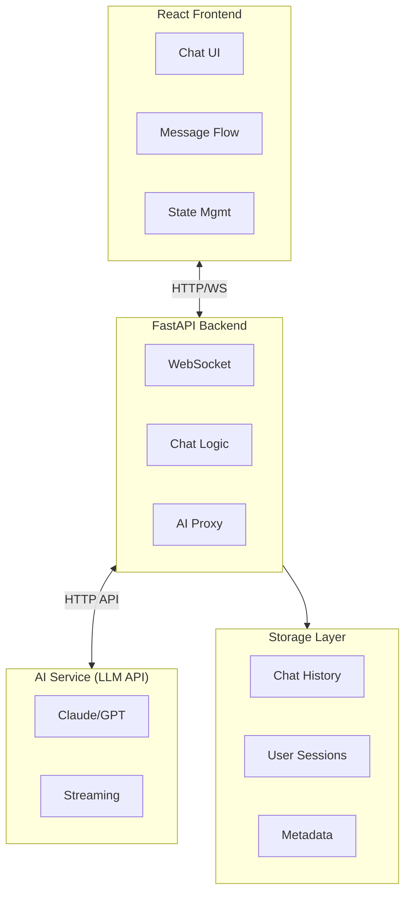

# Stupid Chat Bot

The most stupid chat bot with AI - a simple, straightforward chat application that connects users with an AI assistant.

## Table of Contents
- [Use Cases](#use-cases)
- [Tech Stack](#tech-stack)
  - [Backend](#backend)
  - [Frontend](#frontend)
  - [AI Integration](#ai-integration)
- [Architecture](#architecture)
  - [High-Level Overview](#high-level-overview)
  - [Component Details](#component-details)
- [Fancy Chat Component](#fancy-chat-component)
  - [UI Features](#ui-features)
  - [Recommended Libraries](#recommended-libraries)
  - [Example Component Structure](#example-component-structure)
- [Implementation Phases](#implementation-phases)
  - [Phase 1: Foundation Setup](#phase-1-foundation-setup-week-1)
  - [Phase 1.5: Code Quality & CI](#phase-15-code-quality--ci-week-15)
  - [Phase 2: Basic Chat Functionality](#phase-2-basic-chat-functionality-week-2)
  - [Phase 3: AI Integration](#phase-3-ai-integration-week-3)
  - [Phase 4: Enhanced UI/UX](#phase-4-enhanced-uiux-week-4)
  - [Phase 5: Persistence & History](#phase-5-persistence--history-week-5)
  - [Phase 6: Testing & Deployment](#phase-6-testing--deployment-week-6)
- [Optional Enhancements](#optional-enhancements-post-mvp)
- [Getting Started](#getting-started)
- [Contributing](#contributing)
- [License](#license)

## Use Cases

This chat bot is designed for casual, collaborative interactions:

- **Multi-user chat without authentication** - No login required, just jump in and start chatting
- **Anonymous or named participation** - Users can choose a display name or stay anonymous
- **AI responds when mentioned/tagged** - The AI will answer when specifically called upon using @mentions or tags
- **Persistent history while users are online** - Chat history is maintained as long as at least one user remains connected

## Tech Stack

### Backend
- **FastAPI** - Modern, fast Python web framework for building APIs
  - Async support for handling multiple concurrent connections
  - Automatic API documentation with Swagger/OpenAPI
  - WebSocket support for real-time chat functionality
  - Type hints and data validation with Pydantic

### Frontend
- **React** - Component-based UI library
  - Modern hooks-based architecture
  - Efficient virtual DOM for smooth updates
  - Rich ecosystem of chat-related libraries

### AI Integration
- **LiteLLM** - Universal LLM API library supporting multiple providers
  - Unified interface for 100+ AI providers
  - OpenAI-compatible API format
  - Built-in streaming support for real-time responses
  - Cost tracking and budget management
  - Automatic retries and fallback logic

- **Supported AI Providers** (Top 5):
  - **Anthropic** (Claude 3.5 Sonnet, Claude 3 Opus, Claude 3 Haiku)
  - **OpenAI** (GPT-4 Turbo, GPT-4o, GPT-3.5 Turbo)
  - **Google** (Gemini 1.5 Pro, Gemini 1.5 Flash)
  - **Meta** (Llama 3.1 - 405B, 70B, 8B)
  - **DeepSeek** (DeepSeek-V3, DeepSeek-Coder)

- **Features**:
  - Easy provider switching via environment variables
  - Streaming response support for real-time message generation
  - Conversation context management

## Architecture

### High-Level Overview



### Component Details

#### Frontend Components
- **ChatContainer** - Main container managing chat state
- **MessageList** - Scrollable message history with virtualization
- **MessageBubble** - Individual message display with markdown support
- **InputBox** - User input with auto-resize and keyboard shortcuts
- **TypingIndicator** - Animated indicator shown when AI is generating any response
- **ChatHeader** - Title, status, and controls

#### Backend Services
- **WebSocket Manager** - Handles real-time connections
- **Chat Service** - Business logic for message processing
- **AI Client** - Wrapper for LLM API calls with streaming
- **History Manager** - Storage and retrieval of conversations

## Fancy Chat Component

For the "most fancy" chat experience, we recommend:

### UI Features
- **Smooth Animations**
  - Message entrance animations (fade + slide)
  - Typing indicator with animated dots
  - Smooth auto-scroll to latest message

- **Rich Message Rendering**
  - Markdown support (code blocks, lists, links)
  - Syntax highlighting for code snippets
  - LaTeX rendering for mathematical expressions
  - Image/file preview support

- **Modern Design**
  - Gradient backgrounds or subtle patterns
  - Glass morphism effects for message bubbles
  - Dark/light theme toggle
  - Custom emoji reactions
  - Avatar support

### Recommended Libraries
- **react-markdown** - Markdown rendering
- **highlight.js** or **prism-react-renderer** - Code syntax highlighting
- **framer-motion** - Smooth animations
- **react-window** or **react-virtuoso** - Efficient list virtualization for long chats
- **emoji-mart** - Emoji picker
- **react-hot-toast** - Notifications

### Example Component Structure
```jsx
<ChatContainer>
  <ChatHeader title="Stupid Chat Bot" status="online" />
  <MessageList>
    {messages.map(msg => (
      <MessageBubble
        key={msg.id}
        content={msg.content}
        sender={msg.sender}
        timestamp={msg.timestamp}
        animated={true}
      />
    ))}
    <TypingIndicator visible={isAiTyping} />
  </MessageList>
  <InputBox
    onSend={handleSendMessage}
    placeholder="Type your message..."
    maxLength={2000}
  />
</ChatContainer>
```

## Implementation Phases

### Phase 1: Foundation Setup (Week 1)
**Goal**: Basic project structure and development environment

- [ ] Initialize repository structure
  ```
  stupid_chat_bot/
  ├── backend/
  │   ├── app/
  │   │   ├── main.py
  │   │   ├── api/
  │   │   ├── services/
  │   │   └── models/
  │   ├── requirements.txt
  │   └── .env.example
  ├── frontend/
  │   ├── src/
  │   │   ├── components/
  │   │   ├── services/
  │   │   └── App.jsx
  │   ├── package.json
  │   └── vite.config.js
  └── docker-compose.yml
  ```

- [ ] Set up FastAPI backend skeleton
  - Basic app structure with CORS
  - Health check endpoint
  - Environment configuration

- [ ] Set up React frontend with Vite
  - Project scaffolding
  - Basic routing (if needed)
  - Dev server configuration

- [ ] Create Docker setup for local development
- [ ] Set up linting and formatting (Black, ESLint, Prettier)

**Deliverables**:
- Running backend on `http://localhost:8000`
- Running frontend on `http://localhost:5173`
- Docker containers for both services

---

### Phase 1.5: Code Quality & CI (Week 1.5)
**Goal**: Establish code quality standards and automated checks

- [ ] Set up pre-commit hooks
  - Black formatting for Python
  - Ruff linting for Python
  - ESLint for JavaScript/JSX
  - Prettier for frontend formatting
  - Gitleaks for secret detection
  - General quality checks (trailing whitespace, file sizes, etc.)

- [ ] Create GitHub Actions workflow for CI
  - Backend quality checks (Black, Ruff)
  - Frontend quality checks (ESLint, Prettier)
  - Security scanning (Gitleaks, Trivy)
  - Run on push to master/main and on pull requests

- [ ] Add development dependencies
  - `requirements-dev.txt` for Python tooling
  - Update package.json with Prettier

- [ ] Documentation updates
  - Document pre-commit setup in CLAUDE.md
  - Add CI badge to README (optional)
  - Update development workflow instructions

**Deliverables**:
- Pre-commit hooks preventing bad code from being committed
- CI pipeline blocking PRs with code quality issues
- Automated security scanning for secrets and vulnerabilities
- Clean, consistent codebase following project standards

---

### Phase 2: Basic Chat Functionality (Week 2)
**Goal**: Simple non-AI chat working end-to-end

- [ ] Backend: WebSocket endpoint
  - Connection management
  - Message broadcasting
  - Basic error handling

- [ ] Frontend: Basic chat UI
  - Simple message list
  - Input box
  - Send/receive messages via WebSocket

- [ ] Frontend: Message state management
  - Local state or Context API
  - Message history array
  - Auto-scroll to bottom

- [ ] Basic styling with CSS/Tailwind
  - Message bubbles (user vs bot)
  - Responsive layout
  - Mobile-friendly design

**Deliverables**:
- Users can type and see messages in real-time
- Messages are broadcast to all connected users

---

### Phase 3: AI Integration (Week 3)
**Goal**: Connect to LLM and stream responses

- [x] Backend: AI service integration
  - [x] Universal multi-provider support via LiteLLM
  - [x] Support for top 5 AI providers (Anthropic, OpenAI, Google, Meta, DeepSeek)
  - [x] Streaming API client implementation
  - [x] Environment variable configuration for API keys
  - [x] Provider and model selection via config

- [x] Backend: Chat endpoint with AI
  - [x] Process user messages and detect @ai/@bot mentions
  - [x] Stream AI responses via WebSocket
  - [x] Handle API errors gracefully
  - [x] Conversation history management

- [x] Frontend: Handle streaming responses
  - [x] Display partial messages as they arrive
  - [x] Typing indicator during generation
  - [x] Real-time streaming message handling

- [x] Frontend: Message formatting
  - [x] Markdown rendering with react-markdown
  - [x] Code syntax highlighting with highlight.js
  - [x] GitHub Flavored Markdown support

**Deliverables**:
- ✅ Functional AI chat bot with multi-provider support
- ✅ Streaming responses visible in real-time
- ✅ Proper error messages for API failures
- ✅ Easy provider switching via environment variables

---

### Phase 4: Enhanced UI/UX (Week 4)
**Goal**: Make it "fancy" with animations and polish

- [ ] Frontend: Implement fancy components
  - Smooth message animations (framer-motion)
  - Gradient backgrounds or themes
  - Glass morphism effects
  - Custom scrollbar

- [ ] Frontend: Rich features
  - Theme toggle (dark/light)
  - Emoji picker
  - Message reactions
  - Timestamp formatting

- [ ] Frontend: Better input handling
  - Auto-resize textarea
  - Keyboard shortcuts (Enter to send, Shift+Enter for newline)
  - Character counter
  - Disabled state during sending

- [ ] Polish and refinements
  - Loading states
  - Empty state design
  - Error state designs
  - Toast notifications

**Deliverables**:
- Polished, animated chat interface
- Smooth user experience
- Professional-looking design

---

### Phase 5: Persistence & History (Week 5)
**Goal**: Save and retrieve chat history

- [ ] Backend: Database setup
  - Choose database (PostgreSQL, SQLite, or MongoDB)
  - Set up ORM (SQLAlchemy or motor)
  - Create chat message schema

- [ ] Backend: History API
  - Save messages to database
  - Retrieve conversation history
  - Pagination for long chats

- [ ] Backend: Session management
  - Create/retrieve chat sessions
  - Multi-conversation support
  - Session metadata

- [ ] Frontend: History features
  - Load previous messages on mount
  - Infinite scroll for history
  - Sidebar with past conversations
  - Clear/delete conversation

**Deliverables**:
- Messages persist across page refreshes
- Users can access conversation history
- Multiple chat sessions supported

---

### Phase 6: Testing & Deployment (Week 6)
**Goal**: Production-ready application

- [ ] Backend: Testing
  - Unit tests for services
  - Integration tests for API endpoints
  - WebSocket connection tests

- [ ] Frontend: Testing
  - Component tests with React Testing Library
  - E2E tests with Playwright/Cypress
  - Accessibility testing

- [ ] Performance optimization
  - Message list virtualization
  - Image lazy loading
  - Bundle size optimization
  - Backend response caching

- [ ] Deployment setup
  - Choose hosting (Railway, Render, Vercel, AWS, etc.)
  - CI/CD pipeline
  - Environment variable management
  - SSL/HTTPS configuration

- [ ] Documentation
  - API documentation (auto-generated by FastAPI)
  - User guide
  - Deployment guide
  - Contributing guidelines

**Deliverables**:
- Tested, production-ready application
- Deployed and accessible online
- Complete documentation

---

## Optional Enhancements (Post-MVP)

### Advanced Features
- **Multi-modal Support**: Image upload and analysis
- **Voice Input**: Speech-to-text integration
- **File Attachments**: Document upload and processing
- **Search**: Full-text search across chat history
- **Export**: Download conversations as PDF/TXT

### User Features
- **Authentication**: User accounts and login
- **Profiles**: Customizable user profiles and avatars
- **Sharing**: Share conversations via link
- **Favorites**: Bookmark important messages
- **Multi-language**: i18n support

### System Features
- **Rate Limiting**: Prevent API abuse
- **Analytics**: Usage tracking and metrics
- **Admin Panel**: Monitor system health
- **API Rate Limits**: Manage AI API costs
- **Caching**: Redis for session and response caching

## Getting Started

### Prerequisites
- Python 3.12
- [uv](https://github.com/astral-sh/uv) - Fast Python package installer
- Node.js 18+
- Docker (optional)

### Development Setup

(To be completed in Phase 1)

### Environment Variables

See `backend/.env.example` for all available configuration options.

**Required for AI functionality:**

```bash
# Choose your AI provider
AI_PROVIDER=anthropic  # Options: anthropic, openai, google, meta, deepseek

# Set the API key for your chosen provider
ANTHROPIC_API_KEY=your-anthropic-key-here
# OR
OPENAI_API_KEY=your-openai-key-here
# OR
GOOGLE_API_KEY=your-google-key-here
```

**Optional:**

```bash
# Override the default model for your provider
AI_MODEL=claude-3-opus-20240229
# If not set, uses provider defaults:
#   anthropic: claude-3-5-sonnet-20241022
#   openai: gpt-4-turbo
#   google: gemini-1.5-pro
#   meta: llama-3.1-70b
#   deepseek: deepseek-chat
```

**Switching Providers:**

To switch from one AI provider to another:
1. Update `AI_PROVIDER` in your `.env` file
2. Set the corresponding API key environment variable
3. Optionally set `AI_MODEL` to use a specific model
4. Restart the backend server

No code changes required!

## Contributing

This is the "stupid chat bot" - contributions are welcome! Please feel free to:
- Report bugs
- Suggest features
- Submit pull requests
- Improve documentation

## License

MIT License - see [LICENSE](LICENSE) file for details
