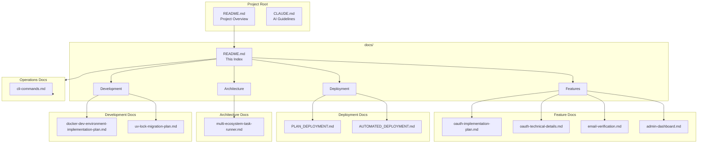

# Documentation Index

This directory contains technical documentation for the Stupid Chat Bot project.

## Table of Contents

- [Quick Links](#quick-links)
- [Documentation Overview](#documentation-overview)
- [Features](#features)
- [Deployment](#deployment)
- [Architecture & Design](#architecture--design)
- [Development](#development)
- [Operations](#operations)
- [Guidelines](#guidelines)

---

## Quick Links

| Document | Description |
|----------|-------------|
| [Main README](../README.md) | Project overview, setup, and usage |
| [CLAUDE.md](../CLAUDE.md) | AI assistant guidelines for this codebase |
| [Backend README](../backend/README.md) | Python/FastAPI backend documentation |
| [Frontend README](../frontend/README.md) | React frontend documentation |

---

## Documentation Overview

---

## Features

Documentation for planned and implemented features.

| Document | Description | Status |
|----------|-------------|--------|
| [oauth-implementation-plan.md](./oauth-implementation-plan.md) | OAuth 2.0 authentication implementation plan | Planning |
| [oauth-technical-details.md](./oauth-technical-details.md) | OAuth 2.0 technical details (populated during implementation) | Placeholder |
| [oauth-setup-guide.md](./oauth-setup-guide.md) | OAuth provider setup instructions | Active |
| [email-verification.md](./email-verification.md) | Email verification system documentation | Active |
| [admin-dashboard.md](./admin-dashboard.md) | Admin dashboard and user management | Active |

### Key Topics
- OAuth 2.0 (Google, GitHub, Facebook)
- Email/password authentication with verification
- User tiers and message limits
- Admin dashboard and user management

---

## Deployment

Documentation for deploying the application to production.

| Document | Description | Status |
|----------|-------------|--------|
| [PLAN_DEPLOYMENT.md](./PLAN_DEPLOYMENT.md) | Deployment architecture and phases overview | Reference |
| [AUTOMATED_DEPLOYMENT.md](./AUTOMATED_DEPLOYMENT.md) | Step-by-step automated deployment setup guide | Active |

### Key Topics
- DigitalOcean droplet setup
- Docker container deployment
- GitHub Actions CI/CD
- SSL/TLS configuration
- Health checks and rollback

---

## Architecture & Design

Documentation covering system architecture and design decisions.

| Document | Description |
|----------|-------------|
| [multi-ecosystem-task-runner.md](./multi-ecosystem-task-runner.md) | Task runner architecture (Make + Invoke + npm) |

### Key Topics
- Multi-ecosystem coordination
- Task automation patterns
- Development workflow

---

## Development

Documentation for development environment and tooling.

| Document | Description |
|----------|-------------|
| [docker-dev-environment-implementation-plan.md](./docker-dev-environment-implementation-plan.md) | Docker development environment analysis |
| [uv-lock-migration-plan.md](./uv-lock-migration-plan.md) | Python dependency management with uv |

### Key Topics
- Docker development workflow
- Dependency management
- Reproducible builds

---

## Operations

Documentation for operational tasks and administration.

| Document | Description |
|----------|-------------|
| [cli-commands.md](./cli-commands.md) | CLI commands reference (admin, stats, user management) |

### Key Topics
- Database statistics
- User role management (make-admin)
- User data deletion
- Production maintenance

---

## Guidelines

### Documentation Standards

All documentation in this project should follow these guidelines:

1. **Table of Contents**: Every document should have a TOC at the top
2. **Mermaid Diagrams**: Use [Mermaid.js](https://mermaid.js.org/) for all diagrams
3. **Cross-References**: Link to related documents where applicable
4. **Code Examples**: Include runnable examples where possible
5. **Keep Updated**: Update docs when code changes

### Adding New Documentation

1. Create the markdown file in the appropriate location
2. Add a TOC at the top
3. Use Mermaid for any diagrams
4. Add entry to this index
5. Cross-reference from related docs

---

## Related Resources

- [GitHub Repository](https://github.com/dremdem/stupid_chat_bot)
- [Issue Tracker](https://github.com/dremdem/stupid_chat_bot/issues)
- [Pull Requests](https://github.com/dremdem/stupid_chat_bot/pulls)
