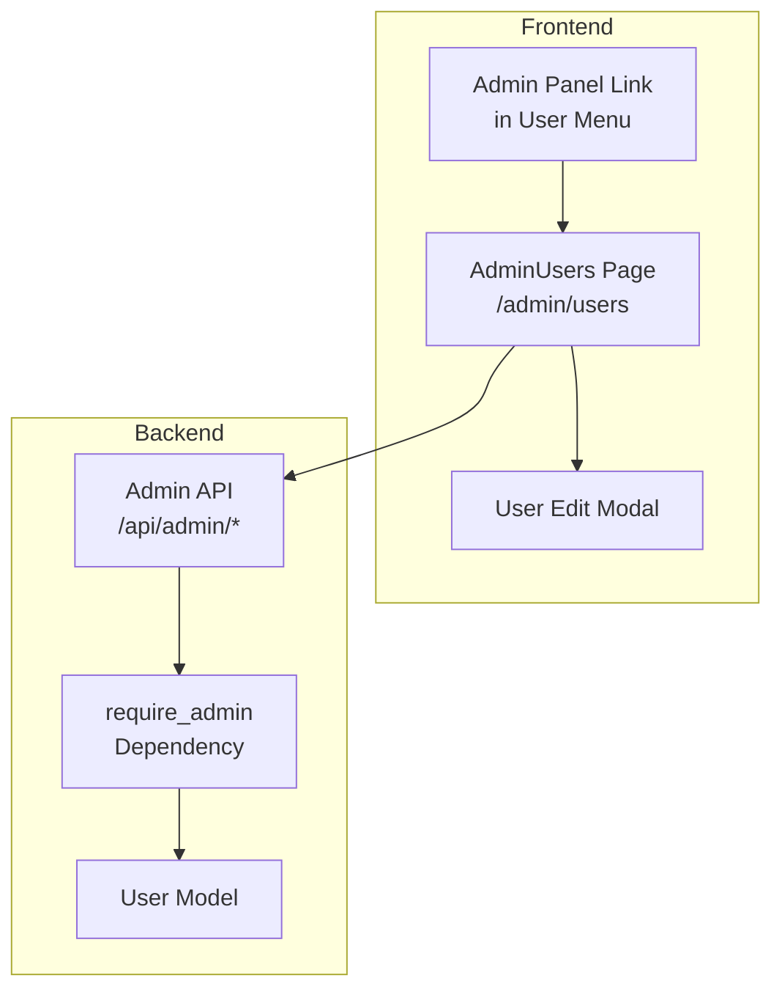

# Admin Dashboard

Documentation for the admin dashboard and user management features.

## Table of Contents

- [Overview](#overview)
- [Access Requirements](#access-requirements)
- [Features](#features)
- [API Endpoints](#api-endpoints)
- [Frontend Components](#frontend-components)
- [Usage](#usage)

---

## Overview

The admin dashboard provides administrators with tools to manage users, view system statistics, and perform administrative tasks. It is accessible at `/admin/users` for authenticated users with the admin role.



---

## Access Requirements

To access the admin dashboard:

1. User must be authenticated (via OAuth or email/password)
2. User must have the `admin` role
3. User must not be blocked

### Granting Admin Access

Use the CLI command to grant admin access:

```bash
# Using make
make make-admin email=user@example.com

# Using invoke directly
cd backend && uv run invoke make-admin --email user@example.com
```

See [CLI Commands](./cli-commands.md) for more details.

---

## Features

### User List

- Paginated list of all users in the system
- Search by email or display name
- Filter by role (user, unlimited, admin)
- Filter by status (active, blocked)
- View message count and registration date

### User Management

For each user, administrators can:

1. **Change Role**: Update user role to user, unlimited, or admin
2. **Block/Unblock**: Prevent or allow user access
3. **Set Message Limit**: Override the default message limit for a specific user

### Safety Features

- Administrators cannot demote themselves
- Administrators cannot block themselves
- All admin actions are logged

---

## API Endpoints

All endpoints require admin authentication.

### List Users

```http
GET /api/admin/users
```

Query parameters:
- `page` (int, default: 1): Page number
- `page_size` (int, default: 20, max: 100): Items per page
- `search` (string): Search by email or name
- `role` (string): Filter by role (user, unlimited, admin)
- `blocked` (bool): Filter by blocked status

Response:
```json
{
  "users": [...],
  "total": 100,
  "page": 1,
  "page_size": 20,
  "total_pages": 5
}
```

### Get User Details

```http
GET /api/admin/users/{user_id}
```

Returns detailed information about a specific user.

### Update User Role

```http
PATCH /api/admin/users/{user_id}/role
Content-Type: application/json

{
  "role": "unlimited"
}
```

Valid roles: `user`, `unlimited`, `admin`

### Block/Unblock User

```http
PATCH /api/admin/users/{user_id}/block
Content-Type: application/json

{
  "is_blocked": true
}
```

### Update Message Limit

```http
PATCH /api/admin/users/{user_id}/limit
Content-Type: application/json

{
  "message_limit": 100
}
```

Set to `null` to use the default limit for the user's role.

---

## Frontend Components

### Location

Admin components are located in `frontend/src/components/admin/`:

| Component | Description |
|-----------|-------------|
| `AdminUsers.jsx` | Main admin page with user list and filters |
| `AdminUsers.css` | Styles for admin page |
| `UserEditModal.jsx` | Modal for editing user properties |
| `UserEditModal.css` | Styles for edit modal |
| `RoleBadge.jsx` | Role indicator component |
| `RoleBadge.css` | Role badge styles |

### API Service

The admin API service is located at `frontend/src/services/adminApi.js` and provides:

- `listUsers(options)`: Fetch paginated user list
- `getUser(userId)`: Get user details
- `updateUserRole(userId, role)`: Update user role
- `updateUserBlock(userId, isBlocked)`: Block/unblock user
- `updateUserLimit(userId, messageLimit)`: Set message limit

---

## Usage

### Accessing the Dashboard

1. Log in as an admin user
2. Click on your avatar in the header
3. Click "Admin Panel" in the dropdown menu
4. Or navigate directly to `/admin/users`

### Managing Users

1. **Search**: Enter email or name in the search box and click "Search"
2. **Filter**: Use the dropdown menus to filter by role or status
3. **Edit**: Click the "Edit" button on a user row to open the edit modal
4. **Save**: Make changes in the modal and click "Save Changes"

### Role Descriptions

| Role | Description | Message Limit |
|------|-------------|---------------|
| `user` | Standard registered user | 30 messages/day (default) |
| `unlimited` | Premium user with no message limits | Unlimited |
| `admin` | Full administrative access | Unlimited |

---

## Related Documentation

- [CLI Commands](./cli-commands.md) - Command-line tools for user management
- [Email Verification](./email-verification.md) - Email verification system
- [OAuth Setup Guide](./oauth-setup-guide.md) - OAuth provider configuration
