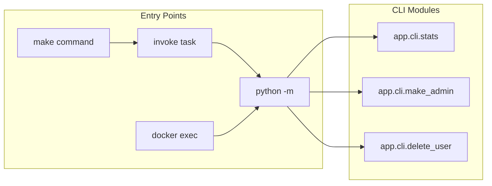

# CLI Commands Reference

Command-line tools for managing the Stupid Chat Bot application.

## Table of Contents

- [Overview](#overview)
- [Database Statistics](#database-statistics)
- [User Management](#user-management)
  - [Make Admin](#make-admin)
  - [Delete User](#delete-user)
- [Usage Patterns](#usage-patterns)
- [Production Usage](#production-usage)

---

## Overview

The backend provides several CLI commands for administration and development tasks. All commands can be run via:

1. **Make** (recommended) - From project root
2. **Invoke** - From backend directory
3. **Direct Python** - Module execution
4. **Docker** - In production containers



---

## Database Statistics

Display database statistics including user counts, message metrics, and activity data.

### Usage

```bash
# Via make
make backend-db-stats

# Via invoke
cd backend && invoke db-stats
cd backend && invoke db-stats --days 7  # Last 7 days only

# Direct CLI
cd backend && python -m app.cli.stats
cd backend && python -m app.cli.stats --days 30
```

### Options

| Option | Description |
|--------|-------------|
| `--days N` | Limit statistics to last N days |

### Example Output

```
============================================================
              DATABASE STATISTICS
============================================================

 USER COUNTS
   Registered users:     127
   Unique session owners:245
   Total chat sessions:  312

 USERS BY ROLE
   user            120
   admin             5
   unlimited         2

 TOP 5 ACTIVE USERS (by messages)
   1. user@example.com                 234 msgs
   2. power@user.com                   189 msgs
   3. active@site.com                  145 msgs

 MESSAGE STATISTICS
   Total messages:       3456
   User messages:        1728
   Assistant messages:   1728
   Messages today:       89
   Avg per session:      11.1

============================================================
```

---

## User Management

### Make Admin

Promote or demote users to/from admin role.

#### Usage

```bash
# Promote to admin
make make-admin EMAIL=user@example.com

# Demote from admin
make make-admin EMAIL=user@example.com DEMOTE=1

# Dry run (preview changes)
make make-admin EMAIL=user@example.com DRY_RUN=1

# Via invoke
cd backend && invoke make-admin --email user@example.com
cd backend && invoke make-admin --email user@example.com --demote
cd backend && invoke make-admin --email user@example.com --dry-run

# Direct CLI
cd backend && python -m app.cli.make_admin user@example.com
cd backend && python -m app.cli.make_admin user@example.com --demote
cd backend && python -m app.cli.make_admin user@example.com --dry-run
```

#### Options

| Option | Make Variable | Description |
|--------|---------------|-------------|
| `--demote` | `DEMOTE=1` | Demote admin to regular user |
| `--dry-run` | `DRY_RUN=1` | Preview changes without applying |

#### Example Output

**Promote to admin:**
```
==================================================
         USER ROLE UPDATED
==================================================

 User: admin@example.com
 ID: 12345678-1234-1234-1234-123456789012
 Name: Admin User
 Provider: email

 Role change: user → admin

==================================================
User is now an admin!
```

**Already admin:**
```
==================================================
         NO CHANGE NEEDED
==================================================

 User: admin@example.com
 ID: 12345678-1234-...
 Name: Admin User
 Provider: email

 User is already 'admin'

==================================================
No action taken
```

---

### Delete User

Delete all data associated with a user by email. Useful for testing and GDPR compliance.

#### Usage

```bash
# Delete user and all data
make delete-user EMAIL=user@example.com

# Dry run (preview what would be deleted)
make delete-user EMAIL=user@example.com DRY_RUN=1

# Via invoke
cd backend && invoke delete-user --email user@example.com
cd backend && invoke delete-user --email user@example.com --dry-run

# Direct CLI
cd backend && python -m app.cli.delete_user user@example.com
cd backend && python -m app.cli.delete_user user@example.com --dry-run
```

#### Options

| Option | Make Variable | Description |
|--------|---------------|-------------|
| `--dry-run` | `DRY_RUN=1` | Preview what would be deleted |

#### What Gets Deleted

| Data Type | Relationship | Method |
|-----------|--------------|--------|
| User | Primary record | Deleted |
| EmailVerificationToken | FK to User | CASCADE |
| UserSession (auth) | FK to User | CASCADE |
| Messages | FK to User | Explicit delete |
| ChatSessions | Contains user's messages | Explicit delete |

#### Example Output

```
==================================================
         USER DATA DELETED
==================================================

 User: test@example.com
 ID: 12345678-1234-1234-1234-123456789012
 Name: Test User
 Provider: email

 Items affected:
   Verification tokens: 2
   Auth sessions:       1
   Messages:            15
   Chat sessions:       3

==================================================
All user data has been deleted!
```

---

## Usage Patterns

### Development (Local)

```bash
# From project root
make backend-db-stats
make make-admin EMAIL=user@example.com
make delete-user EMAIL=user@example.com

# From backend directory
cd backend
invoke db-stats
invoke make-admin --email user@example.com
invoke delete-user --email user@example.com
```

### Production (Docker)

```bash
# SSH into server, then:
docker exec stupidbot-backend .venv/bin/python -m app.cli.stats
docker exec stupidbot-backend .venv/bin/python -m app.cli.make_admin user@example.com
docker exec stupidbot-backend .venv/bin/python -m app.cli.delete_user user@example.com
```

### CI/CD Pipeline

```bash
# In GitHub Actions or similar
docker exec stupidbot-backend .venv/bin/python -m app.cli.make_admin $INITIAL_ADMIN_EMAIL
```

---

## Production Usage

### Initial Admin Setup

After first deployment, create the initial admin user:

```bash
# SSH into production server
ssh user@your-server

# Promote first admin
docker exec stupidbot-backend .venv/bin/python -m app.cli.make_admin admin@yourdomain.com
```

### Checking Database Health

```bash
# Quick stats check
docker exec stupidbot-backend .venv/bin/python -m app.cli.stats

# Last 7 days activity
docker exec stupidbot-backend .venv/bin/python -m app.cli.stats --days 7
```

### User Cleanup (GDPR)

```bash
# Preview what will be deleted
docker exec stupidbot-backend .venv/bin/python -m app.cli.delete_user user@example.com --dry-run

# Actually delete
docker exec stupidbot-backend .venv/bin/python -m app.cli.delete_user user@example.com
```

---

## Related Documentation

- [Email Verification](./email-verification.md) - Email verification system
- [Multi-Ecosystem Task Runner](./multi-ecosystem-task-runner.md) - Make/Invoke architecture
- [Automated Deployment](./AUTOMATED_DEPLOYMENT.md) - Production deployment guide
