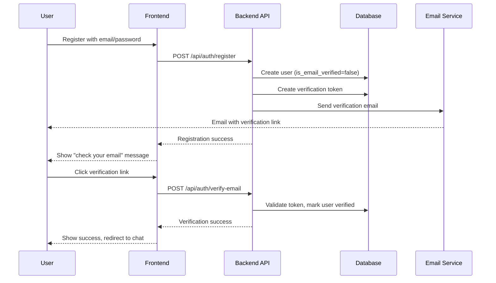
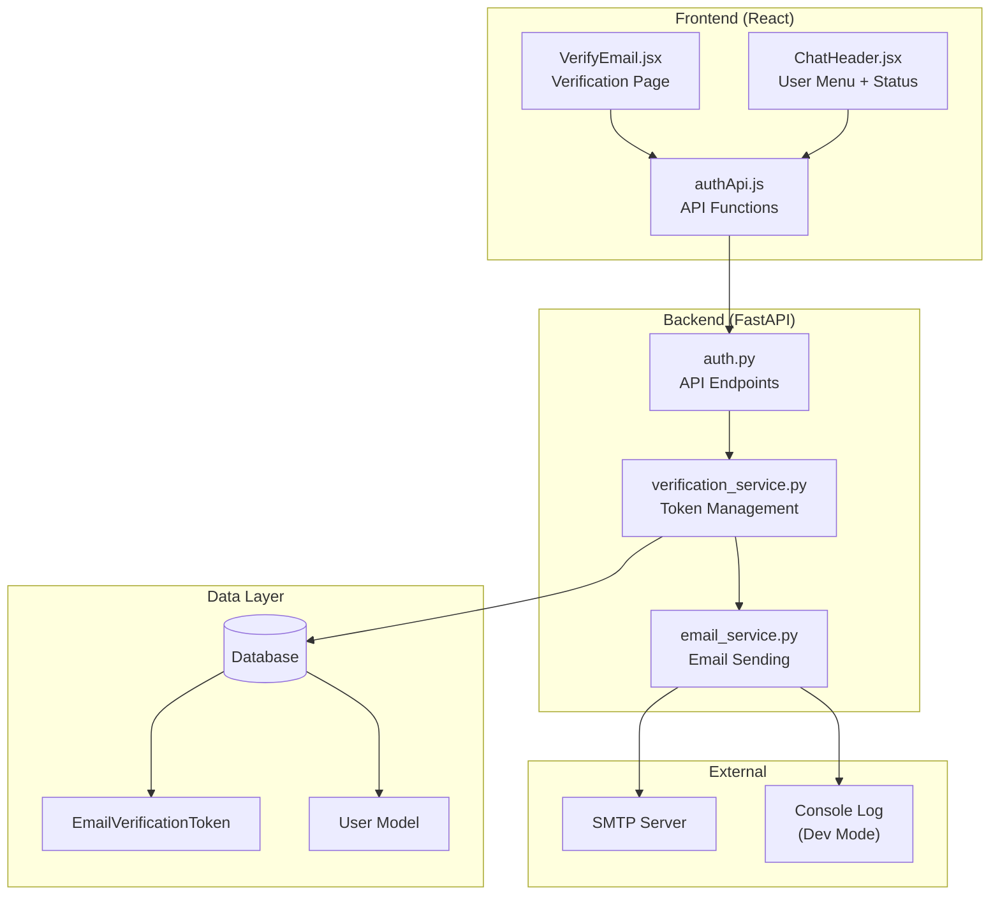
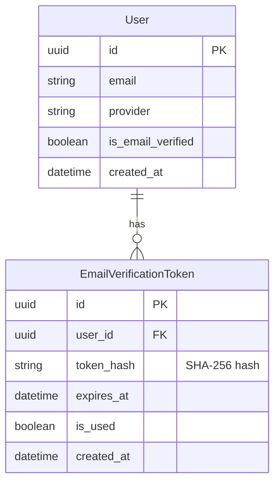
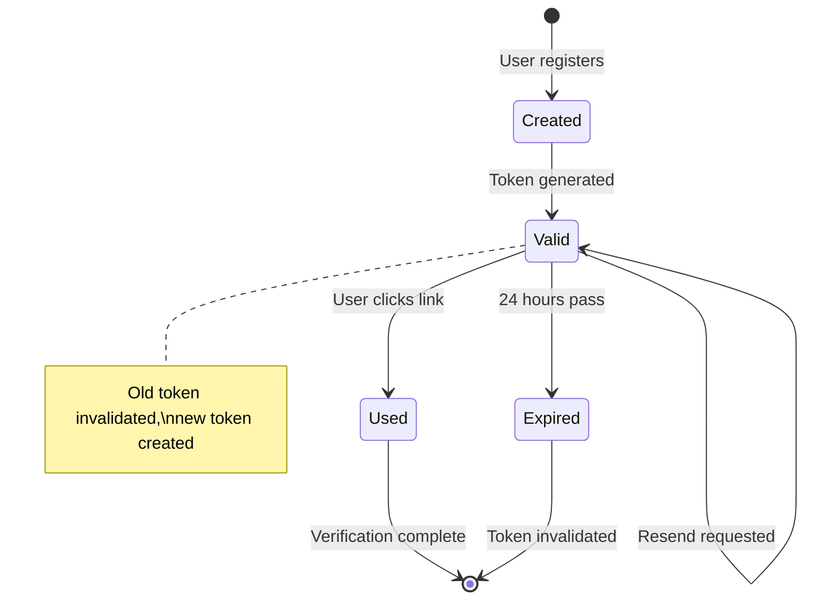
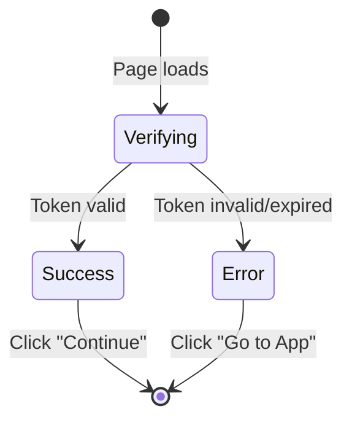
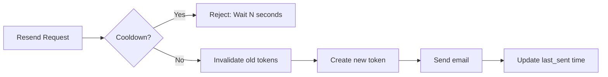

# Email Verification System

Complete documentation for the email verification feature in Stupid Chat Bot.

## Table of Contents

- [Overview](#overview)
- [Architecture](#architecture)
- [Configuration](#configuration)
- [Database Schema](#database-schema)
- [API Endpoints](#api-endpoints)
- [Frontend Components](#frontend-components)
- [Security Considerations](#security-considerations)
- [Development vs Production](#development-vs-production)
- [Troubleshooting](#troubleshooting)

---

## Overview

The email verification system ensures that users who register with email/password have valid email addresses. This prevents abuse and enables important user communications.

### Key Features

- **Token-based verification**: Secure SHA-256 hashed tokens sent via email
- **Expiration**: Tokens expire after 24 hours (configurable)
- **Rate limiting**: Resend requests limited to once per 60 seconds
- **Dev-friendly**: Console logging when SMTP not configured
- **User feedback**: Clear UI for verification status and resend option

### User Flow



---

## Architecture

### Component Overview



### File Structure

```
backend/
├── app/
│   ├── api/
│   │   └── auth.py              # Verification endpoints
│   ├── models/
│   │   └── email_verification.py # Token model
│   ├── services/
│   │   ├── email_service.py      # SMTP/console email
│   │   └── verification_service.py # Token logic
│   └── config.py                 # SMTP settings
└── alembic/versions/
    └── c3d4e5f6a7b8_add_email_verification_tokens_table.py

frontend/
└── src/
    ├── components/
    │   ├── VerifyEmail.jsx       # Verification page
    │   ├── VerifyEmail.css
    │   ├── ChatHeader.jsx        # User menu with status
    │   └── ChatHeader.css
    └── services/
        └── authApi.js            # API functions
```

---

## Configuration

### Environment Variables

Add to your `.env` file:

```bash
# SMTP Configuration (leave empty for dev mode console logging)
SMTP_HOST=smtp.example.com
SMTP_PORT=587
SMTP_USER=your-username
SMTP_PASSWORD=your-password
SMTP_FROM_EMAIL=noreply@yourdomain.com
SMTP_FROM_NAME=Stupid Chat Bot
SMTP_USE_TLS=true

# Verification Settings
EMAIL_VERIFICATION_TOKEN_EXPIRE_HOURS=24
EMAIL_VERIFICATION_RESEND_COOLDOWN_SECONDS=60
```

### Configuration Options

| Setting | Default | Description |
|---------|---------|-------------|
| `SMTP_HOST` | `""` (empty) | SMTP server hostname. Empty = console logging |
| `SMTP_PORT` | `587` | SMTP server port |
| `SMTP_USER` | `""` | SMTP authentication username |
| `SMTP_PASSWORD` | `""` | SMTP authentication password |
| `SMTP_FROM_EMAIL` | `noreply@stupidbot.local` | Sender email address |
| `SMTP_FROM_NAME` | `Stupid Chat Bot` | Sender display name |
| `SMTP_USE_TLS` | `true` | Use STARTTLS (true) or SSL (false) |
| `EMAIL_VERIFICATION_TOKEN_EXPIRE_HOURS` | `24` | Hours until token expires |
| `EMAIL_VERIFICATION_RESEND_COOLDOWN_SECONDS` | `60` | Seconds between resend requests |

---

## Database Schema

### EmailVerificationToken Model



### Token Lifecycle



---

## API Endpoints

### POST /api/auth/verify-email

Verify a user's email address using the token from the email link.

**Request:**
```json
{
  "token": "abc123def456..."
}
```

**Response (Success):**
```json
{
  "success": true,
  "message": "Email verified successfully! You can now enjoy full access."
}
```

**Response (Error):**
```json
{
  "success": false,
  "message": "Verification link has expired. Please request a new one."
}
```

**Error Cases:**
| Status | Message |
|--------|---------|
| 400 | Verification link has expired |
| 400 | Verification link is invalid |
| 400 | Email already verified |

---

### POST /api/auth/resend-verification

Request a new verification email. Rate limited.

**Request:** None (uses session cookie)

**Response (Success):**
```json
{
  "success": true,
  "message": "Verification email sent! Check your inbox."
}
```

**Response (Rate Limited):**
```json
{
  "success": false,
  "message": "Please wait 45 seconds before requesting another email."
}
```

**Error Cases:**
| Status | Message |
|--------|---------|
| 401 | Not authenticated |
| 400 | Email already verified |
| 400 | Only email accounts need verification |
| 429 | Rate limit (wait N seconds) |

---

### Registration Flow Update

The `POST /api/auth/register` endpoint now:
1. Creates user with `is_email_verified=false`
2. Generates verification token
3. Sends verification email
4. Returns success with verification notice

---

## Frontend Components

### VerifyEmail Page

Handles the `/verify-email?token=...` URL when user clicks email link.

**States:**



**Usage:**
```jsx
// In App.jsx
function getVerificationToken() {
  const path = window.location.pathname
  if (path === '/verify-email') {
    const params = new URLSearchParams(window.location.search)
    return params.get('token')
  }
  return null
}

// Render verification page if token present
if (verificationToken !== null) {
  return <VerifyEmail token={verificationToken} onComplete={...} />
}
```

---

### ChatHeader Verification Status

Shows verification warning in user dropdown for unverified email users.

**Detection Logic:**
```jsx
const needsVerification =
  user &&
  user.provider === 'email' &&
  user.is_email_verified === false
```

**UI Elements:**
- Warning message with icon
- "Resend email" button
- Disabled state during send
- Toast notifications for feedback

---

## Security Considerations

### Token Security

1. **Hashing**: Tokens are SHA-256 hashed before storage
   - Raw token sent to user via email
   - Only hash stored in database
   - Prevents token theft if database compromised

2. **Expiration**: Tokens expire after 24 hours
   - Limits window for interception attacks
   - Configurable via environment variable

3. **Single Use**: Tokens marked as used after verification
   - Prevents replay attacks
   - Old tokens invalidated on resend

### Rate Limiting



- 60-second cooldown between resend requests
- Prevents email bombing attacks
- Cooldown based on most recent token's `created_at`

### Best Practices Implemented

- No token in URL query params stored server-side
- HTTPS required for production (token in transit)
- Token not logged in production mode
- User feedback doesn't reveal if email exists (registration)

---

## Development vs Production

### Development Mode

When `SMTP_HOST` is empty (not configured), emails are logged to console:

```
============================================================
EMAIL (dev mode - not sent)
To: user@example.com
Subject: Verify your email - Stupid Chat Bot
------------------------------------------------------------
Hi user,

Thanks for signing up for Stupid Chat Bot!
Please verify your email address by clicking the link below:

http://localhost:5173/verify-email?token=abc123...

This link will expire in 24 hours.
============================================================
```

**Benefits:**
- No SMTP server needed for development
- Easy to test full flow locally
- Token visible in logs for manual testing

### Production Mode

When SMTP is configured, emails are sent via SMTP:

```bash
# Production .env
SMTP_HOST=smtp.sendgrid.net
SMTP_PORT=587
SMTP_USER=apikey
SMTP_PASSWORD=SG.your-api-key
SMTP_FROM_EMAIL=noreply@yourdomain.com
```

**Recommended Providers:**
- SendGrid
- Mailgun
- Amazon SES
- Postmark

---

## Troubleshooting

### Common Issues

#### "Verification link has expired"

**Cause:** Token older than 24 hours.

**Solution:** Click "Resend email" in user menu to get new link.

---

#### "Please wait N seconds before requesting another email"

**Cause:** Rate limit hit.

**Solution:** Wait for cooldown (60 seconds) before retrying.

---

#### Email not received

**Checklist:**
1. Check spam/junk folder
2. In dev mode: Check console logs for email content
3. Verify SMTP credentials in production
4. Check SMTP server logs

---

#### Verification page shows error immediately

**Possible causes:**
- Token already used
- Token expired
- Malformed URL (token parameter missing)

**Solution:** Request new verification email from user menu.

---

### Debug Logging

Enable debug logging to troubleshoot:

```python
# In backend, set logging level
import logging
logging.getLogger("app.services.email_service").setLevel(logging.DEBUG)
logging.getLogger("app.services.verification_service").setLevel(logging.DEBUG)
```

---

## Related Documentation

- [OAuth Implementation Plan](./oauth-implementation-plan.md) - Full authentication system
- [OAuth Technical Details](./oauth-technical-details.md) - OAuth provider setup
- [OAuth Setup Guide](./oauth-setup-guide.md) - Provider configuration

---

## Changelog

| Date | Change |
|------|--------|
| 2025-01-12 | Initial implementation (Issue #82) |
