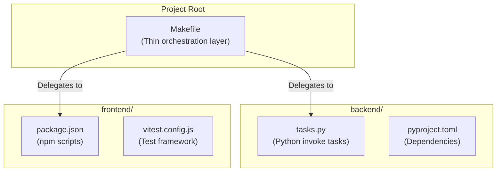

# Multi-Ecosystem Task Runner Architecture

## Table of Contents

- [Overview](#overview)
- [Design Pattern](#design-pattern-task-runner-per-ecosystem-make-as-glue)
- [Architecture](#architecture)
- [Why This Pattern?](#why-this-pattern)
- [Implementation Details](#implementation-details)
- [Usage Examples](#usage-examples)
- [Integration with Existing Workflow](#integration-with-existing-workflow)
- [Implementation Checklist](#implementation-checklist)
- [Future Enhancements](#future-enhancements)
- [References](#references)

---

## Overview

This document describes the implementation of a unified task runner architecture for the Stupid Chat Bot project, which spans multiple technology ecosystems (Python backend, React frontend).

## Design Pattern: "Task Runner Per Ecosystem, Make as Glue"

### Philosophy

Each ecosystem (backend/frontend) should use its native, idiomatic task runner:
- **Backend (Python)**: Uses `invoke` (Python-native task automation)
- **Frontend (React)**: Uses `npm scripts` (Node.js-native task automation)
- **Root Level**: Uses `GNU Make` as a thin coordination layer

This approach respects each ecosystem's conventions while providing a unified interface for developers.

## Architecture



## Why This Pattern?

### Benefits

1. **Ecosystem Respect**: Each ecosystem uses its native tools
   - Backend developers use familiar `invoke` commands
   - Frontend developers use familiar `npm run` commands
   - No forcing Python developers to learn npm, or vice versa

2. **Minimal Dependencies**: Make is available everywhere
   - Ships with macOS and most Linux distributions
   - Simple, stable, and well-understood
   - No additional runtime requirements

3. **Thin Coordination**: Makefile is just a router
   - No business logic in Make
   - Delegates to ecosystem-specific tools
   - Easy to understand and maintain

4. **Unified Interface**: Common tasks work the same way
   - `make test` - runs tests for both ecosystems
   - `make lint` - runs linters for both ecosystems
   - `make dev` - starts development servers for both

5. **Wildcard Delegation**: Direct access to ecosystem tasks
   - `make backend-lint` → `invoke lint`
   - `make frontend-dev` → `npm run dev`
   - Provides escape hatch for ecosystem-specific operations

### Comparison with Alternatives

**Alternative 1: Single Task Runner (e.g., all npm scripts)**
- ❌ Forces Python developers to use Node.js tools
- ❌ Requires Node.js installed even for backend-only work
- ❌ npm scripts don't handle Python well

**Alternative 2: Single Task Runner (e.g., all invoke)**
- ❌ Forces frontend developers to use Python tools
- ❌ Requires Python installed even for frontend-only work
- ❌ invoke doesn't handle npm well

**Alternative 3: Shell Scripts**
- ❌ Platform-specific (bash vs zsh vs sh)
- ❌ No standard help/discovery mechanism
- ❌ Harder to maintain than declarative Make syntax

**Our Choice: Make as Glue**
- ✅ Ecosystem-native tools for each part
- ✅ Minimal dependencies (Make is everywhere)
- ✅ Clear separation of concerns
- ✅ Self-documenting with `make help`

## Implementation Details

### Root Makefile Structure

#### 1. Help Target (Self-Documentation)

```makefile
help: ## Show this help message
	@echo "Multi-Ecosystem Task Runner - Stupid Chat Bot"
	@echo ""
	@echo "Available targets:"
	@grep -E '^[a-zA-Z_-]+:.*?## .*$$' $(MAKEFILE_LIST) | \
		awk 'BEGIN {FS = ":.*?## "}; {printf "  \033[36m%-20s\033[0m %s\n", $$1, $$2}'
	@echo ""
	@echo "Wildcard delegation:"
	@echo "  backend-<task>      Run backend invoke task"
	@echo "  frontend-<task>     Run frontend npm script"
```

**Features**:
- Colored output (cyan for task names)
- Automatically extracts descriptions from `## comments`
- Lists wildcard delegation patterns
- Self-documenting: adding new tasks automatically updates help

#### 2. Main Orchestration Targets

```makefile
dev: ## Start development servers (backend + frontend)
	docker compose up

test: ## Run tests for both ecosystems
	cd backend && invoke test
	cd frontend && npm run test

lint: ## Run linters for both ecosystems
	cd backend && invoke lint
	cd frontend && npm run lint

format: ## Format code for both ecosystems
	cd backend && invoke format
	cd frontend && npm run format
```

**Design Principles**:
- Sequential execution (backend first, then frontend)
- Fail fast (if backend fails, frontend doesn't run)
- Change directory + delegate (no complex path handling)

#### 3. Wildcard Delegation

```makefile
backend-%: ## Run any backend invoke task (e.g., make backend-lint)
	cd backend && invoke $*

frontend-%: ## Run any frontend npm script (e.g., make frontend-dev)
	cd frontend && npm run $*
```

**How It Works**:
- `%` is a pattern match in Make
- `$*` captures the matched portion
- `make backend-lint` → `cd backend && invoke lint`
- `make frontend-dev` → `cd frontend && npm run dev`

**Use Cases**:
- Ecosystem-specific tasks not needed across both sides
- Quick access without typing full commands
- Exploration: `make backend-` + tab completion

### Backend Tasks (invoke)

Already implemented in `backend/tasks.py`:
- `test` - Run tests in Docker
- `test-local` - Run tests locally
- `lint` - Run Ruff linter
- `lint-docker` - Run linter in Docker
- `format` - Run Black formatter
- `format-docker` - Run formatter in Docker
- `check` - Run all checks (format + lint + test)
- `dev` - Start development server
- `clean` - Clean cache files
- `install` - Install dependencies
- `lock` - Update lock file
- `precommit` - Run pre-commit hooks

**New Task to Add**:
- `ci` - Run CI pipeline locally (format check + lint + test)

### Frontend Tasks (npm scripts)

Existing in `frontend/package.json`:
- `dev` - Start development server
- `build` - Build production bundle
- `preview` - Preview production build
- `lint` - Run ESLint
- `format` - Run Prettier

**New Tasks to Add**:
- `test` - Run tests with Vitest (once)
- `test:watch` - Run tests in watch mode
- `test:ui` - Run tests with web UI
- `test:coverage` - Run tests with coverage report
- `format:check` - Check formatting without changes
- `clean` - Clean build artifacts and caches
- `ci` - Run CI pipeline (format:check + lint + test)

### Test Framework: Vitest

**Why Vitest**:
- Modern, Vite-native test runner
- Extremely fast (uses Vite's transformation pipeline)
- Jest-compatible API (easy migration if needed)
- First-class ESM support
- Built-in coverage via c8
- Watch mode with instant HMR
- Web UI for interactive test exploration

**Dependencies to Install**:
```json
{
  "devDependencies": {
    "vitest": "^1.0.0",
    "@vitest/ui": "^1.0.0",
    "jsdom": "^23.0.0",
    "@testing-library/react": "^14.0.0",
    "@testing-library/jest-dom": "^6.0.0"
  }
}
```

**Configuration** (`frontend/vitest.config.js`):
```javascript
import { defineConfig } from 'vitest/config'
import react from '@vitejs/plugin-react'

export default defineConfig({
  plugins: [react()],
  test: {
    globals: true,
    environment: 'jsdom',
    setupFiles: './src/test/setup.js',
    css: true,
  },
})
```

**Test Setup** (`frontend/src/test/setup.js`):
```javascript
import { expect, afterEach } from 'vitest'
import { cleanup } from '@testing-library/react'
import * as matchers from '@testing-library/jest-dom/matchers'

// Extend Vitest's expect with jest-dom matchers
expect.extend(matchers)

// Cleanup after each test
afterEach(() => {
  cleanup()
})
```

## Usage Examples

### Common Workflows

#### Full Development Setup
```bash
# Clone repository
git clone <repo-url>
cd stupid_chat_bot

# Install all dependencies
make install

# Start development servers
make dev
```

#### Code Quality Workflow
```bash
# Format code
make format

# Run linters
make lint

# Run all checks (format + lint + test)
make check
```

#### Testing Workflow
```bash
# Run all tests (both ecosystems)
make test

# Run only backend tests
make backend-test

# Run only frontend tests
make frontend-test

# Run frontend tests in watch mode
make frontend-test:watch

# Run frontend tests with UI
make frontend-test:ui
```

#### CI/CD Simulation
```bash
# Run the full CI pipeline locally
make ci

# This will:
# 1. Check formatting (no changes)
# 2. Run linters
# 3. Run all tests
```

#### Ecosystem-Specific Tasks
```bash
# Backend-specific
make backend-lint-docker     # Run linter in Docker
make backend-lock            # Update lock file
make backend-precommit       # Run pre-commit hooks

# Frontend-specific
make frontend-build          # Build production bundle
make frontend-preview        # Preview production build
make frontend-test:coverage  # Run tests with coverage
```

#### Clean Slate
```bash
# Clean all build artifacts and caches
make clean

# Reinstall dependencies
make install
```

### Task Name Consistency

Where possible, task names are consistent across ecosystems:

| Task | Backend (invoke) | Frontend (npm) | Make |
|------|-----------------|----------------|------|
| Development server | `dev` | `dev` | `dev` |
| Run tests | `test` | `test` | `test` |
| Lint code | `lint` | `lint` | `lint` |
| Format code | `format` | `format` | `format` |
| Run all checks | `check` | N/A | `check` |
| Clean artifacts | `clean` | `clean` | `clean` |
| Install deps | `install` | N/A | `install` |
| CI pipeline | `ci` | `ci` | `ci` |

This consistency makes the system predictable and easy to learn.

## Integration with Existing Workflow

### Hybrid Development Model (Issue #25)

The project uses a hybrid development model:
- **Local**: Fast linting, formatting, task automation (~20 packages)
- **Docker**: Consistent test environment (CI = Production)

The Makefile respects this by:
- `make format` → runs locally (fast)
- `make lint` → runs locally (fast)
- `make test` → runs in Docker (consistent)

### Lock File Management (Issue #18)

Backend uses `uv.lock` for reproducible builds. The Makefile supports:
- `make backend-lock` → regenerate lock file
- `make install` → install from lock file
- Pre-commit hooks verify lock file is up to date

### Docker Compose Integration

`make dev` uses Docker Compose for:
- Starting both backend and frontend in containers
- Automatic dependency management
- Volume mounting for live reload
- Network setup for backend ↔ frontend communication

### CI/CD Compatibility

The `make ci` task mirrors the GitHub Actions workflow:
1. Format check (no modifications)
2. Lint check
3. Run tests

Developers can run `make ci` before pushing to catch issues locally.

## TypeScript Decision

**Current Status**: Frontend uses JavaScript (JSX), not TypeScript

**Issue #30 mentions `typecheck` script**, but this is deferred because:
- CLAUDE.md states: "Use TypeScript for frontend in later phases"
- No `tsconfig.json` exists
- Converting to TypeScript is a separate effort (Phase 6/7)

**When TypeScript is added**, the implementation will be:
```json
{
  "scripts": {
    "typecheck": "tsc --noEmit"
  }
}
```

And Makefile can add:
```makefile
typecheck: ## Type check TypeScript code
	cd frontend && npm run typecheck
```

## Benefits for Different Roles

### For Developers
- ✅ Single command to start everything: `make dev`
- ✅ Don't need to remember invoke vs npm run
- ✅ Self-documenting: `make help` shows all options
- ✅ Wildcard access for ecosystem-specific tasks
- ✅ Local CI validation before pushing

### For CI/CD
- ✅ Can optionally use `make ci` for consistency
- ✅ Or continue using direct commands (no requirement)
- ✅ Makefile documents the expected workflow

### For New Contributors
- ✅ Clear entry point: run `make help`
- ✅ Standard interface regardless of ecosystem
- ✅ Easy to explore: `make backend-<tab>` shows options
- ✅ Documentation in one place

### For Maintainers
- ✅ Centralized task definitions
- ✅ Easy to add new tasks (just update Makefile + ecosystem)
- ✅ Self-documenting with `## comments`
- ✅ No business logic to maintain in Make

## Implementation Checklist

### Phase 1: Root Makefile
- [ ] Create `Makefile` at project root
- [ ] Implement help target with colored output
- [ ] Add main orchestration targets (dev, test, lint, format, check, clean, install, ci)
- [ ] Add wildcard delegation (backend-%, frontend-%)
- [ ] Test all targets locally

### Phase 2: Frontend Test Setup
- [ ] Install Vitest dependencies (`npm install --save-dev vitest @vitest/ui jsdom @testing-library/react @testing-library/jest-dom`)
- [ ] Create `frontend/vitest.config.js`
- [ ] Create `frontend/src/test/setup.js`
- [ ] Create example test `frontend/src/test/App.test.jsx`
- [ ] Update `frontend/package.json` scripts (test, test:watch, test:ui, test:coverage, format:check, clean, ci)
- [ ] Run `npm run test` to verify setup

### Phase 3: Backend CI Task
- [ ] Add `ci` task to `backend/tasks.py`
- [ ] Test `invoke ci` locally
- [ ] Verify it mirrors GitHub Actions workflow

### Phase 4: Documentation Updates
- [ ] Update root `README.md` with Makefile usage
- [ ] Update `backend/README.md` with invoke ci task
- [ ] Update `CLAUDE.md` with new development workflow

### Phase 5: Validation
- [ ] Run `make help` - displays formatted help
- [ ] Run `make dev` - starts Docker Compose
- [ ] Run `make test` - runs tests for both ecosystems
- [ ] Run `make lint` - runs linters for both
- [ ] Run `make format` - formats both codebases
- [ ] Run `make check` - runs all checks
- [ ] Run `make ci` - runs CI pipeline
- [ ] Run `make backend-lint` - delegates to invoke
- [ ] Run `make frontend-dev` - delegates to npm
- [ ] Verify all tasks pass

## Future Enhancements

### Potential Additions
- Parallel task execution (e.g., `make -j2 lint` to run backend + frontend in parallel)
- Coverage thresholds enforcement
- Pre-commit integration (run `make format lint` before commit)
- Watch mode for unified development (`make watch`)
- Environment-specific targets (`make test-prod`, `make test-staging`)

### Multi-Service Expansion
If the project adds more services (e.g., database migrations, API gateway):
```makefile
database-%:
	cd database && ./manage.py $*

gateway-%:
	cd gateway && cargo $*
```

The pattern scales naturally to additional ecosystems.

## References

- Issue #30: Multi-Ecosystem Task Runner Architecture
- Issue #25: Hybrid Workflow (Local Linters + Docker Tests)
- Issue #18: UV Lock File Migration
- GNU Make Manual: https://www.gnu.org/software/make/manual/
- Invoke Documentation: https://www.pyinvoke.org/
- Vitest Documentation: https://vitest.dev/

## Conclusion

The "Task Runner Per Ecosystem, Make as Glue" pattern provides:
- ✅ Unified interface for developers
- ✅ Respect for ecosystem conventions
- ✅ Minimal dependencies and complexity
- ✅ Clear separation of concerns
- ✅ Easy extension for future services

By using Make as a thin coordination layer, we avoid the pitfalls of forcing one ecosystem's tools onto another, while still providing the convenience of a single entry point for common tasks.
