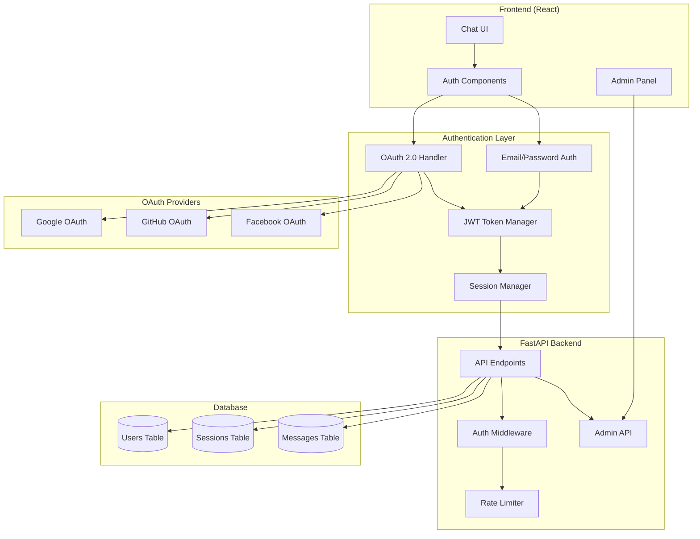
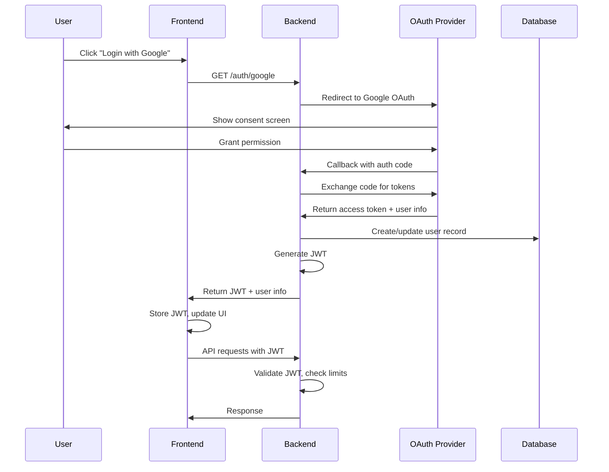

# OAuth 2.0 Authentication - Implementation Plan

## Table of Contents

- [Overview](#overview)
- [Requirements Summary](#requirements-summary)
- [Architecture Overview](#architecture-overview)
- [Implementation Phases](#implementation-phases)
  - [Phase 1: Database Schema & User Model](#phase-1-database-schema--user-model)
  - [Phase 2: Message Limits & Anonymous Users](#phase-2-message-limits--anonymous-users)
  - [Phase 3: OAuth 2.0 Providers](#phase-3-oauth-20-providers)
  - [Phase 4: Email/Password Authentication](#phase-4-emailpassword-authentication)
  - [Phase 5: Admin Panel](#phase-5-admin-panel)
  - [Phase 6: Testing & Documentation](#phase-6-testing--documentation)
- [Progress Tracking](#progress-tracking)
- [Dependencies](#dependencies)
- [Related Documents](#related-documents)

---

## Overview

This document outlines the implementation plan for adding OAuth 2.0 authentication to the Stupid Chat Bot application, as specified in [Issue #56](https://github.com/dremdem/stupid_chat_bot/issues/56).

**Goal**: Implement a tiered access system with OAuth 2.0 authentication, message limits, and an admin panel for user management.

---

## Requirements Summary

### User Tiers

| Tier | Access Level | Message Limit | Requirements |
|------|--------------|---------------|--------------|
| Anonymous | Basic | 5 messages | None |
| Authenticated | Standard | 30 messages | OAuth or email login |
| Unlimited | Full | Unlimited | Admin-granted |
| Admin | Full + Management | Unlimited | Admin-designated |

### Authentication Methods

- OAuth 2.0: Google, GitHub, Facebook
- Email/Password fallback

### Admin Capabilities

- Block/unblock users
- Grant unlimited access
- Adjust context window size (default: 20 messages)
- Designate admin accounts

---

## Architecture Overview



### Authentication Flow



---

## Implementation Phases

### Phase 1: Database Schema & User Model

**Goal**: Extend database to support users, authentication, and message tracking.

#### Tasks

- [ ] Create `users` table with fields:
  - `id` (UUID, primary key)
  - `email` (unique, nullable for OAuth-only users)
  - `password_hash` (nullable for OAuth users)
  - `display_name`
  - `avatar_url`
  - `provider` (google, github, facebook, email)
  - `provider_id` (external OAuth ID)
  - `role` (anonymous, user, unlimited, admin)
  - `message_limit` (nullable, overrides default)
  - `context_window_size` (default: 20)
  - `is_blocked` (boolean)
  - `created_at`, `updated_at`

- [ ] Create `user_sessions` table:
  - `id` (UUID)
  - `user_id` (foreign key)
  - `refresh_token_hash`
  - `expires_at`
  - `created_at`

- [ ] Update `messages` table:
  - Add `user_id` foreign key
  - Add index for user message counting

- [ ] Create Alembic migrations
- [ ] Create SQLAlchemy models
- [ ] Create Pydantic schemas

#### Deliverables

- `backend/app/models/user.py`
- `backend/app/schemas/user.py`
- `backend/alembic/versions/xxx_add_users_table.py`

---

### Phase 2: Message Limits & Anonymous Users

**Goal**: Implement message counting and limits for anonymous users.

#### Tasks

- [ ] Create message counting service
- [ ] Implement anonymous user tracking (via cookies/fingerprint)
- [ ] Add middleware to check message limits
- [ ] Create limit exceeded response with login prompt
- [ ] Add WebSocket support for limit notifications
- [ ] Update frontend to show remaining messages
- [ ] Add "login required" modal

#### Deliverables

- `backend/app/services/message_limits.py`
- `backend/app/middleware/rate_limit.py`
- `frontend/src/components/LoginPrompt.jsx`
- Updated `frontend/src/components/Chat.jsx`

---

### Phase 3: OAuth 2.0 Providers

**Goal**: Implement OAuth 2.0 authentication with Google, GitHub, and Facebook.

#### Tasks

- [ ] Install and configure `authlib` or `python-social-auth`
- [ ] Implement OAuth callback handler
- [ ] Create JWT token generation and validation
- [ ] Implement refresh token rotation

**Google OAuth**:
- [ ] Register app in Google Cloud Console
- [ ] Implement `/auth/google` and `/auth/google/callback`
- [ ] Handle user creation/login

**GitHub OAuth**:
- [ ] Register OAuth app in GitHub
- [ ] Implement `/auth/github` and `/auth/github/callback`
- [ ] Handle user creation/login

**Facebook OAuth**:
- [ ] Register app in Facebook Developers
- [ ] Implement `/auth/facebook` and `/auth/facebook/callback`
- [ ] Handle user creation/login

**Frontend**:
- [ ] Create login page with OAuth buttons
- [ ] Implement token storage (httpOnly cookies preferred)
- [ ] Add auth context/state management
- [ ] Update API client to include auth headers

#### Deliverables

- `backend/app/routers/auth.py`
- `backend/app/services/oauth.py`
- `backend/app/services/jwt.py`
- `frontend/src/pages/Login.jsx`
- `frontend/src/context/AuthContext.jsx`
- `frontend/src/hooks/useAuth.js`

---

### Phase 4: Email/Password Authentication

**Goal**: Provide email/password fallback for users without OAuth accounts.

#### Tasks

- [ ] Implement password hashing (bcrypt/argon2)
- [ ] Create registration endpoint with email verification
- [ ] Create login endpoint
- [ ] Implement password reset flow
- [ ] Add email sending service (or use third-party)
- [ ] Create frontend forms:
  - [ ] Registration form
  - [ ] Login form
  - [ ] Password reset form
- [ ] Add form validation

#### Deliverables

- `backend/app/routers/auth_email.py`
- `backend/app/services/email.py`
- `frontend/src/components/auth/RegisterForm.jsx`
- `frontend/src/components/auth/LoginForm.jsx`
- `frontend/src/components/auth/PasswordReset.jsx`

---

### Phase 5: Admin Panel

**Goal**: Create admin dashboard for user management.

#### Tasks

- [ ] Create admin-only middleware/decorator
- [ ] Implement admin API endpoints:
  - [ ] `GET /admin/users` - List all users with pagination
  - [ ] `GET /admin/users/:id` - Get user details
  - [ ] `PATCH /admin/users/:id` - Update user (role, limits, block)
  - [ ] `DELETE /admin/users/:id` - Delete user
  - [ ] `GET /admin/stats` - Usage statistics

- [ ] Create admin frontend:
  - [ ] User list with search/filter
  - [ ] User detail view
  - [ ] Block/unblock toggle
  - [ ] Grant unlimited access button
  - [ ] Context window size adjustment
  - [ ] Admin role assignment

- [ ] Add audit logging for admin actions

#### Deliverables

- `backend/app/routers/admin.py`
- `backend/app/services/admin.py`
- `frontend/src/pages/Admin.jsx`
- `frontend/src/components/admin/UserList.jsx`
- `frontend/src/components/admin/UserDetail.jsx`

---

### Phase 6: Testing & Documentation

**Goal**: Ensure reliability and document the feature.

#### Tasks

- [ ] Unit tests for auth services
- [ ] Integration tests for OAuth flows
- [ ] E2E tests for login/logout
- [ ] Security testing:
  - [ ] JWT validation
  - [ ] CSRF protection
  - [ ] Rate limiting on auth endpoints
- [ ] Update API documentation
- [ ] Update user documentation
- [ ] Update CLAUDE.md with auth configuration

#### Deliverables

- `backend/tests/test_auth.py`
- `backend/tests/test_admin.py`
- `frontend/src/__tests__/auth.test.js`
- Updated `docs/oauth-technical-details.md`

---

## Progress Tracking

### Overall Status

| Phase | Status | Progress |
|-------|--------|----------|
| Phase 1: Database Schema | Not Started | 0% |
| Phase 2: Message Limits | Not Started | 0% |
| Phase 3: OAuth Providers | Not Started | 0% |
| Phase 4: Email/Password | Not Started | 0% |
| Phase 5: Admin Panel | Not Started | 0% |
| Phase 6: Testing & Docs | Not Started | 0% |

### Detailed Progress

#### Phase 1 Tasks
- [ ] Create users table
- [ ] Create user_sessions table
- [ ] Update messages table
- [ ] Create Alembic migrations
- [ ] Create SQLAlchemy models
- [ ] Create Pydantic schemas

#### Phase 2 Tasks
- [ ] Message counting service
- [ ] Anonymous user tracking
- [ ] Rate limit middleware
- [ ] Limit exceeded response
- [ ] WebSocket notifications
- [ ] Frontend remaining messages
- [ ] Login required modal

#### Phase 3 Tasks
- [ ] OAuth library setup
- [ ] JWT implementation
- [ ] Google OAuth
- [ ] GitHub OAuth
- [ ] Facebook OAuth
- [ ] Frontend auth components

#### Phase 4 Tasks
- [ ] Password hashing
- [ ] Registration endpoint
- [ ] Login endpoint
- [ ] Password reset
- [ ] Email service
- [ ] Frontend forms

#### Phase 5 Tasks
- [ ] Admin middleware
- [ ] Admin API endpoints
- [ ] Admin frontend
- [ ] Audit logging

#### Phase 6 Tasks
- [ ] Unit tests
- [ ] Integration tests
- [ ] E2E tests
- [ ] Security testing
- [ ] Documentation

---

## Dependencies

### Backend Dependencies

| Package | Purpose |
|---------|---------|
| `authlib` | OAuth 2.0 client |
| `python-jose[cryptography]` | JWT handling |
| `passlib[bcrypt]` | Password hashing |
| `aiosmtplib` | Async email sending (optional) |

### Frontend Dependencies

| Package | Purpose |
|---------|---------|
| `react-router-dom` | Routing for auth pages |
| `@tanstack/react-query` | Auth state management (optional) |

### Environment Variables

```bash
# OAuth Providers
GOOGLE_CLIENT_ID=xxx
GOOGLE_CLIENT_SECRET=xxx
GITHUB_CLIENT_ID=xxx
GITHUB_CLIENT_SECRET=xxx
FACEBOOK_CLIENT_ID=xxx
FACEBOOK_CLIENT_SECRET=xxx

# JWT
JWT_SECRET_KEY=xxx
JWT_ALGORITHM=HS256
JWT_ACCESS_TOKEN_EXPIRE_MINUTES=30
JWT_REFRESH_TOKEN_EXPIRE_DAYS=7

# Email (optional)
SMTP_HOST=smtp.example.com
SMTP_PORT=587
SMTP_USER=xxx
SMTP_PASSWORD=xxx
```

---

## Related Documents

- [OAuth Technical Details](./oauth-technical-details.md) - Technical implementation details
- [Issue #56](https://github.com/dremdem/stupid_chat_bot/issues/56) - Original feature request
- [Main README](../README.md) - Project overview

---

**Document Version**: 1.0
**Created**: 2025-12-23
**Status**: Planning
**Issue**: [#56](https://github.com/dremdem/stupid_chat_bot/issues/56)
