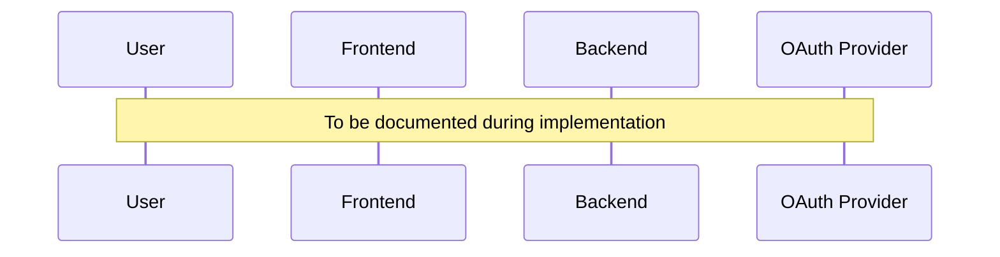
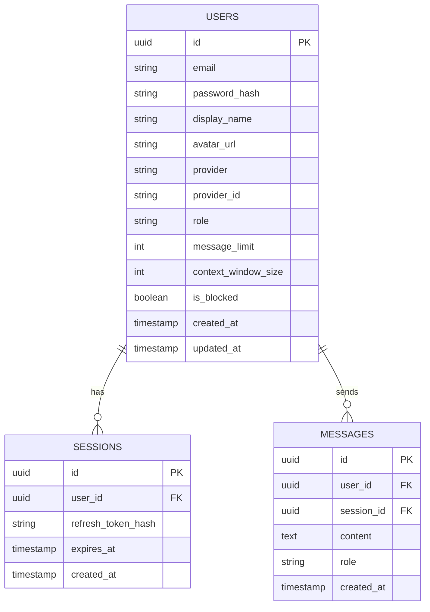

# OAuth 2.0 Authentication - Technical Details

## Table of Contents

- [Overview](#overview)
- [Authentication Flow Details](#authentication-flow-details)
- [Database Schema](#database-schema)
- [API Endpoints](#api-endpoints)
- [Security Considerations](#security-considerations)
- [Configuration](#configuration)
- [Troubleshooting](#troubleshooting)
- [Related Documents](#related-documents)

---

## Overview

> **Note**: This document will be populated with technical implementation details as the OAuth 2.0 feature is developed. See the [Implementation Plan](./oauth-implementation-plan.md) for the current progress.

This document provides technical details for the OAuth 2.0 authentication system implemented in Stupid Chat Bot.

---

## Authentication Flow Details

### OAuth 2.0 Authorization Code Flow



*Details to be added during Phase 3 implementation.*

### JWT Token Structure

```json
{
  "header": {
    "alg": "HS256",
    "typ": "JWT"
  },
  "payload": {
    "sub": "user_id",
    "email": "user@example.com",
    "role": "user",
    "exp": 1234567890,
    "iat": 1234567890
  }
}
```

*Full token structure to be documented during implementation.*

---

## Database Schema

### Users Table

```sql
-- To be documented during Phase 1 implementation
CREATE TABLE users (
    -- Schema will be added here
);
```

### Entity Relationship Diagram



*Full schema details to be added during Phase 1 implementation.*

---

## API Endpoints

### Authentication Endpoints

| Method | Endpoint | Description | Status |
|--------|----------|-------------|--------|
| GET | `/auth/google` | Initiate Google OAuth | Planned |
| GET | `/auth/google/callback` | Google OAuth callback | Planned |
| GET | `/auth/github` | Initiate GitHub OAuth | Planned |
| GET | `/auth/github/callback` | GitHub OAuth callback | Planned |
| GET | `/auth/facebook` | Initiate Facebook OAuth | Planned |
| GET | `/auth/facebook/callback` | Facebook OAuth callback | Planned |
| POST | `/auth/register` | Email registration | Planned |
| POST | `/auth/login` | Email login | Planned |
| POST | `/auth/refresh` | Refresh access token | Planned |
| POST | `/auth/logout` | Logout | Planned |
| POST | `/auth/password-reset` | Request password reset | Planned |

### Admin Endpoints

| Method | Endpoint | Description | Status |
|--------|----------|-------------|--------|
| GET | `/admin/users` | List users | Planned |
| GET | `/admin/users/:id` | Get user details | Planned |
| PATCH | `/admin/users/:id` | Update user | Planned |
| DELETE | `/admin/users/:id` | Delete user | Planned |
| GET | `/admin/stats` | Get statistics | Planned |

*Detailed request/response schemas to be added during implementation.*

---

## Security Considerations

### Implemented Security Measures

> To be documented during implementation

- [ ] JWT token validation
- [ ] Refresh token rotation
- [ ] CSRF protection
- [ ] Rate limiting on auth endpoints
- [ ] Secure cookie settings (httpOnly, secure, sameSite)
- [ ] Password hashing with bcrypt/argon2
- [ ] Input validation and sanitization

### OAuth Security

- State parameter for CSRF protection
- PKCE (Proof Key for Code Exchange) where supported
- Secure storage of client secrets
- Token expiration and refresh

---

## Configuration

### Environment Variables

```bash
# OAuth Providers (to be configured)
GOOGLE_CLIENT_ID=
GOOGLE_CLIENT_SECRET=
GITHUB_CLIENT_ID=
GITHUB_CLIENT_SECRET=
FACEBOOK_CLIENT_ID=
FACEBOOK_CLIENT_SECRET=

# JWT Configuration
JWT_SECRET_KEY=
JWT_ALGORITHM=HS256
JWT_ACCESS_TOKEN_EXPIRE_MINUTES=30
JWT_REFRESH_TOKEN_EXPIRE_DAYS=7

# Application Settings
AUTH_COOKIE_DOMAIN=
AUTH_COOKIE_SECURE=true
```

### Provider Setup Guides

#### Google OAuth Setup

1. Go to [Google Cloud Console](https://console.cloud.google.com/)
2. Create a new project or select existing
3. Enable Google+ API
4. Create OAuth 2.0 credentials
5. Add authorized redirect URIs

*Detailed steps to be added during implementation.*

#### GitHub OAuth Setup

1. Go to [GitHub Developer Settings](https://github.com/settings/developers)
2. Create new OAuth App
3. Configure callback URL

*Detailed steps to be added during implementation.*

#### Facebook OAuth Setup

1. Go to [Facebook Developers](https://developers.facebook.com/)
2. Create new app
3. Add Facebook Login product
4. Configure OAuth settings

*Detailed steps to be added during implementation.*

---

## Troubleshooting

### Common Issues

> To be documented as issues are encountered during development and testing

| Issue | Cause | Solution |
|-------|-------|----------|
| TBD | TBD | TBD |

### Debug Mode

```bash
# Enable auth debug logging
AUTH_DEBUG=true
```

---

## Related Documents

- [OAuth Implementation Plan](./oauth-implementation-plan.md) - Implementation phases and progress
- [Issue #56](https://github.com/dremdem/stupid_chat_bot/issues/56) - Original feature request
- [Deployment Guide](./AUTOMATED_DEPLOYMENT.md) - Production deployment

---

**Document Version**: 1.0
**Created**: 2025-12-23
**Status**: Placeholder - To be populated during implementation
**Issue**: [#56](https://github.com/dremdem/stupid_chat_bot/issues/56)
